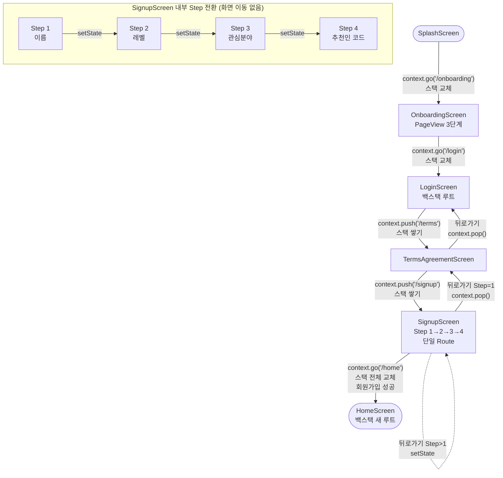
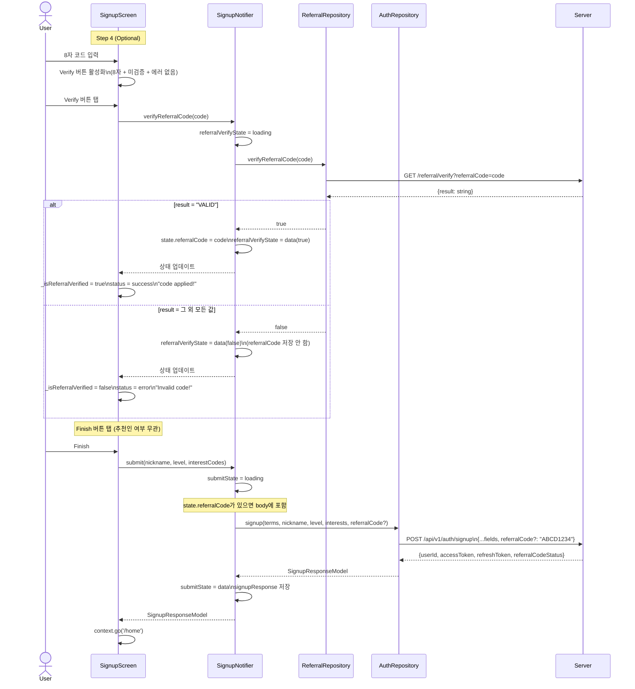

# Onboarding Feature 문서

> 유지보수 전용 문서. Onboarding Feature의 구조 변경 시 반드시 함께 업데이트하세요.

---

## 1. 개요

소셜 로그인 → 약관 동의 → 4단계 회원가입(이름/레벨/관심분야/추천인) → 홈 진입까지의 전체 온보딩 플로우를 담당하는 feature.

---

## 2. 파일 구조

```
lib/features/onboarding/
├── constants/
│   ├── onboarding_constants.dart           # 온보딩 화면 상수
│   ├── login_screen_constants.dart         # 로그인 화면 상수
│   ├── signup_screen_constants.dart        # 회원가입 4단계 상수
│   └── terms_agreement_screen_constants.dart
├── dto/
│   ├── signup_request_dto.dart             # POST /auth/signup 요청 (referralCode 포함)
│   ├── signup_response_dto.dart            # POST /auth/signup 응답 (referralCodeStatus 포함)
│   └── referral_verify_response_dto.dart   # GET  /referral/verify 응답
├── models/
│   ├── signup_response_model.dart          # 앱 내부 회원가입 결과 모델
│   └── terms_info_model.dart               # 약관 동의 상태 모델
├── errors/
│   ├── signup_failure.dart                 # SignupFailure sealed class
│   └── signup_error_mapper.dart            # 서버 에러 코드 → SignupFailure
├── repositories/
│   ├── auth_repository.dart                # 회원가입 API (interface + impl)
│   └── referral_repository.dart            # 추천인 코드 API (interface + impl)
├── providers/
│   └── signup_provider.dart                # SignupNotifier, SignupFormState
├── screens/
│   ├── onboarding_screen.dart              # 앱 소개 (PageView 3단계)
│   ├── login_screen.dart                   # 소셜 로그인 선택
│   ├── terms_agreement_screen.dart         # 약관 동의
│   └── signup_screen.dart                  # 회원가입 Step 1-4
└── widgets/
    ├── onboarding_center_content.dart
    ├── signup_name_input.dart
    ├── signup_level_input.dart
    ├── signup_interest_input.dart
    ├── signup_referral_input.dart
    ├── social_icon_button.dart
    └── terms_agreement_checkbox_cards.dart
```

---

## 3. 화면 흐름도



---

## 4. 데이터 레이어 흐름도

```mermaid
flowchart LR
    subgraph Screen
        SC[SignupScreen\nConsumerStatefulWidget]
        TC[TermsAgreementScreen\nConsumerStatefulWidget]
    end

    subgraph Provider
        SN[SignupNotifier\nkeepAlive: true]
        SFS[SignupFormState]
    end

    subgraph Repository
        AR[AuthRepository]
        RR[ReferralRepository]
    end

    subgraph API
        S_API["POST /api/v1/auth/signup\n(referralCode 포함)"]
        V_API["GET /api/v1/credits/rewards/referral/verify"]
    end

    TC -->|setTermAgreements| SN
    SC -->|submit\nverifyReferralCode\nresetReferralVerifyState| SN
    SN --- SFS
    SN -->|signup + referralCode| AR
    SN -->|verifyReferralCode| RR
    AR -->|SignupRequestDto| S_API
    S_API -->|SignupResponseDto → Model\n(referralCodeStatus 포함)| AR
    RR -->|queryParam: referralCode| V_API
    V_API -->|ReferralVerifyResponseDto| RR
```

---

## 5. 추천인 코드 시퀀스 다이어그램



---

## 6. 라우팅

### RouteNames
**파일:** `lib/core/router/route_names.dart`

```dart
abstract final class RouteNames {
  static const String splash    = '/splash';
  static const String onboarding = '/onboarding';
  static const String terms     = '/terms';
  static const String signup    = '/signup';
  static const String login     = '/login';
  static const String home      = '/home';
}
```

### GoRouter 설정
**파일:** `lib/core/router/app_router.dart`

```dart
final GoRouter appRouter = GoRouter(
  initialLocation: RouteNames.splash,
  routes: [
    GoRoute(path: RouteNames.splash,     builder: (_, __) => SplashScreen()),
    GoRoute(path: RouteNames.onboarding, builder: (_, __) => OnboardingScreen()),
    GoRoute(path: RouteNames.terms,      builder: (_, __) => TermsAgreementScreen()),
    GoRoute(path: RouteNames.signup,     builder: (_, __) => SignupScreen()),
    GoRoute(path: RouteNames.login,      builder: (_, __) => LoginScreen()),
    GoRoute(path: RouteNames.home,       builder: (_, __) => HomeScreen()),
  ],
);
```

### 백스택 상태

| 시점 | 백스택 |
|------|--------|
| 회원가입 진행 중 (Step 1) | `[LoginScreen, TermsAgreementScreen, SignupScreen]` |
| 회원가입 성공 후 | `[HomeScreen]` |

### 뒤로가기 처리

| 화면 | 동작 | 구현 |
|------|------|------|
| `LoginScreen` | 앱 종료 (루트) | GoRouter 기본 동작 |
| `TermsAgreementScreen` | `LoginScreen` 복귀 | `context.pop()` |
| `SignupScreen` Step > 1 | 이전 Step으로 (화면 전환 없음) | `setState(() => _currentStep--)` |
| `SignupScreen` Step = 1 | `TermsAgreementScreen` 복귀 | `context.pop()` |

`SignupScreen`은 `PopScope(canPop: false)`로 물리적 백버튼을 가로채 `_onBack()` 호출:

```dart
PopScope(
  canPop: false,
  onPopInvokedWithResult: (didPop, _) {
    if (!didPop) _onBack();
  },
  child: Scaffold(...),
)
```

---

## 7. API 엔드포인트

**Base URL:** `ApiConstants.baseUrl` (`http://localhost:8000` iOS / `http://10.0.2.2:8000` Android)

| 메서드 | 경로 | 인증 | 설명 |
|--------|------|------|------|
| POST | `/api/v1/auth/signup` | 불필요 | 회원가입 (추천인 코드 포함 처리) |
| GET | `/api/v1/credits/rewards/referral/verify` | 불필요 | 추천인 코드 사전 검증 |

---

## 8. DTO / Model 구조

### SignupRequestDto
**파일:** `dto/signup_request_dto.dart` | **HTTP:** POST `/api/v1/auth/signup`

```dart
@freezed class SignupRequestDto {
  bool termsOfServiceAgreed  // 필수: 이용약관 동의
  bool privacyPolicyAgreed   // 필수: 개인정보처리방침 동의
  bool pushAgreed            // 선택: 푸시 알림 동의
  bool marketingAgreed       // 선택: 마케팅 수신 동의
  String nickname            // 닉네임 (1~10자, 한글·영문만)
  int level                  // 레벨 1~5
  List<String> interests     // 관심분야 코드 리스트
  String? referralCode       // 추천인 코드 (nullable, 미입력 시 null)
}
```

### SignupResponseDto → SignupResponseModel
**파일:** `dto/signup_response_dto.dart`, `models/signup_response_model.dart`

```dart
// 서버 응답 (DTO)
@freezed class SignupResponseDto {
  int userId
  String accessToken
  String refreshToken
  String referralCodeStatus  // 추천인 코드 처리 결과
}

// 앱 내부 모델
@freezed class SignupResponseModel {
  int userId
  String accessToken
  String refreshToken
  String referralCodeStatus  // 추천인 코드 처리 결과
}
```

**referralCodeStatus 가능 값:**

| 값 | 의미 |
|----|------|
| `NONE` | 추천인 코드 미요청 |
| `GRANTED` | 정상 적용 및 리워드 지급 |
| `INVALID_REQUEST` | 코드 형식 오류 |
| `REFERRAL_CODE_NOT_FOUND` | 존재하지 않거나 만료된 코드 |
| `REFERRAL_ALREADY_APPLIED` | 이미 적용 이력 있음 (재적용 불가) |
| `SELF_REFERRAL_NOT_ALLOWED` | 본인 코드 자기 추천 불가 |
| `UNKNOWN_ERROR` | 서버 내부 오류 |

변환: `SignupResponseDtoX.toModel()` extension 사용 (dto 파일 내 정의)

### ReferralVerifyResponseDto
**파일:** `dto/referral_verify_response_dto.dart` | **HTTP:** GET `/referral/verify`

```dart
@freezed class ReferralVerifyResponseDto {
  String result  // 검증 결과 코드
}
```

**result 코드:**

| 값 | 의미 | UI |
|----|------|----|
| `VALID` | 사용 가능 | "code applied!" (success) |
| `INVALID_FORMAT` | 형식 오류 | "Invalid code!" (error) |
| `REFERRAL_CODE_NOT_FOUND` | 존재하지 않음 | "Invalid code!" (error) |
| `REFERRAL_CODE_INACTIVE` | 비활성 상태 | "Invalid code!" (error) |
| `REFERRAL_CODE_EXPIRED` | 만료됨 | "Invalid code!" (error) |
| `SELF_REFERRAL_NOT_ALLOWED` | 본인 코드 | "Invalid code!" (error) |
| `REFERRAL_ALREADY_APPLIED` | 이미 적용됨 | "Invalid code!" (error) |

`repository`에서 `result == 'VALID'` → `true`, 그 외 → `false` 로 변환하여 반환.

### TermsInfoModel
**파일:** `models/terms_info_model.dart`

```dart
class TermsInfoModel {
  bool termsOfService   // 이용약관 동의
  bool privacyPolicy    // 개인정보처리방침 동의
  bool push             // 푸시 동의
  bool marketing        // 마케팅 동의
}
```

---

## 9. 에러 처리

### SignupFailure (sealed class)
**파일:** `errors/signup_failure.dart`

```dart
sealed class SignupFailure extends FeatureException {
  // 필수 약관 미동의
  ConsentRequiredFailure
  // 필수 필드 누락
  InvalidRequestFailure
  // 닉네임 정책 위반
  InvalidNameFailure
  // 레벨 값 오류 (1~5 범위 벗어남)
  InvalidLevelFailure
  // 관심분야 코드 오류 (허용되지 않은 코드)
  InvalidInterestsFailure
}
```

### 서버 에러 코드 매핑
**파일:** `errors/signup_error_mapper.dart`

| 서버 에러 코드 | 매핑 타입 |
|---------------|-----------|
| `CONSENT_REQUIRED` | `ConsentRequiredFailure` |
| `INVALID_REQUEST` | `InvalidRequestFailure` |
| `INVALID_NICKNAME` | `InvalidNameFailure` |
| `INVALID_LEVEL` | `InvalidLevelFailure` |
| `INVALID_INTERESTS` | `InvalidInterestsFailure` |
| 기타 | `ServerException` (원본 메시지 유지) |

---

## 10. Repository

### AuthRepository
**파일:** `repositories/auth_repository.dart`

```dart
abstract interface class AuthRepository {
  Future<SignupResponseModel> signup({
    required TermsInfoModel terms,
    required String nickname,
    required int level,
    required List<String> interests,
    String? referralCode,    // nullable: 미입력 시 null → 서버가 NONE 응답
  });
}
```

- DTO → Model 변환: `SignupResponseDto.toModel()`
- 에러 처리: `DioException` → `mapSignupErrorCode()` → `SignupFailure`
- Provider: `authRepositoryProvider` (`@riverpod`)

### ReferralRepository
**파일:** `repositories/referral_repository.dart`

```dart
abstract interface class ReferralRepository {
  // 코드 유효성 사전 검증 → true/false 반환
  Future<bool> verifyReferralCode(String referralCode);
}
```

- Provider: `referralRepositoryProvider` (`@riverpod`)

---

## 11. SignupNotifier

**파일:** `providers/signup_provider.dart`
**Provider:** `signupNotifierProvider` (`@Riverpod(keepAlive: true)`)

### SignupFormState 필드

| 필드 | 타입 | 설명 |
|------|------|------|
| `termAgreements` | `List<bool>` | [termsOfService, privacyPolicy, push, marketing] |
| `submitState` | `AsyncValue<void>` | 회원가입 API 호출 상태 |
| `referralVerifyState` | `AsyncValue<bool?>` | 추천인 검증 상태 (null = 미검증) |
| `nickname` | `String?` | 회원가입 완료 후 저장 |
| `level` | `int?` | 회원가입 완료 후 저장 |
| `interestCodes` | `List<String>?` | 회원가입 완료 후 저장 |
| `referralCode` | `String?` | 검증 성공한 추천인 코드 (signup 시 body에 포함) |
| `signupResponse` | `SignupResponseModel?` | 회원가입 성공 응답 |

### 메서드

```dart
// 약관 동의 결과 저장 (TermsAgreementScreen → SignupScreen으로 전달)
void setTermAgreements(List<bool> agreements);

// 회원가입 API 호출
// state.referralCode가 있으면 signup body에 포함하여 전송
// 성공 시: SignupResponseModel 반환 (referralCodeStatus 포함)
// 실패 시: null 반환, submitState에 에러 저장
Future<SignupResponseModel?> submit({
  required String nickname,
  required int level,
  required List<String> interestCodes,
});

// 추천인 코드 유효성 사전 검증
// isValid=true → state.referralCode 저장
// isValid=false → state.referralCode 미저장
Future<void> verifyReferralCode(String code);

// 추천인 검증 상태 초기화 (코드 입력 변경 시 호출)
void resetReferralVerifyState();

// 회원가입 제출 상태 초기화
void resetSubmitState();
```

---

## 12. 화면별 설명

### OnboardingScreen
**파일:** `screens/onboarding_screen.dart`
**역할:** 앱 소개 (PageView 3단계)

- 상태: `_currentIndex`, `_pageController`
- 마지막 페이지 "Start" → `context.go(RouteNames.login)`
- 배경: `LinearGradient(pink200 → white)`
- 페이지 데이터: `OnboardingConstants.onboardingPages` (3개)

---

### LoginScreen
**파일:** `screens/login_screen.dart`
**역할:** 소셜 로그인 방식 선택

- Google / Apple 소셜 아이콘 버튼
- 탭 시 → `context.push(RouteNames.terms)`
- Guest 탐색 링크 (미구현)

---

### TermsAgreementScreen
**파일:** `screens/terms_agreement_screen.dart`
**타입:** ConsumerStatefulWidget

**약관 항목 (TermsAgreementScreenConstants.items):**

| 번호 | 내용 | 필수 여부 | URL |
|------|------|-----------|-----|
| 0 | 이용약관 (Terms of Service) | 필수 | `mingoring.com/terms-of-service.html` |
| 1 | 개인정보처리방침 (Privacy Policy) | 필수 | `mingoring.com/privacy-policy.html` |
| 2 | 푸시 알림 수신 | 선택 | 없음 |
| 3 | 마케팅 업데이트 수신 | 선택 | `mingoring.com/marketing-consent.html` |

**Continue 버튼 동작:**
```dart
ref.read(signupNotifierProvider.notifier).setTermAgreements(_accepted);
context.push(RouteNames.signup);
```

---

### SignupScreen
**파일:** `screens/signup_screen.dart`
**타입:** ConsumerStatefulWidget
**구조:** 단일 Route, `_currentStep` (1~4) 로 UI 전환

#### Step별 상태 및 유효성

| Step | 입력 | 유효성 조건 |
|------|------|------------|
| 1 (이름) | TextEditingController | 1자 이상 + 한글·영문만 (`^[가-힣ㄱ-ㅎㅏ-ㅣa-zA-Z]+$`) |
| 2 (레벨) | `_selectedLevelIndex` | null 아님 |
| 3 (관심분야) | `_selectedInterestIndexes` | 1개 이상 선택 |
| 4 (추천인) | `_referralController` | 항상 유효 (Optional) |

#### Step 1 검증 규칙

- 한글·영문만 허용 (숫자·특수문자 불허)
- 최대 10자
- 숫자/특수문자 입력 시: `"Special characters and numbers are not allowed."`
- 허용 문자 외 입력 시: `"Only Korean and English letters are allowed."`

#### Step 4 추천인 입력 규칙

- 최대 8자
- Verify 버튼 활성화 조건: 8자 입력 + 미검증 상태 + 에러 없음 + 로딩 중 아님
- 코드 변경 시 → `resetReferralVerifyState()` + 로컬 상태 초기화
- Step 4는 Skip 가능 (Finish 버튼 항상 활성)

#### 관심분야 코드 매핑

| UI 라벨 | 서버 코드 |
|---------|-----------|
| K-pop | `K_POP` |
| K-Drama & Movies | `K_DRAMA_MOVIES` |
| Daily Life | `DAILY_LIFE` |
| Travel | `TRAVEL` |
| Business | `BUSINESS` |
| Beauty & Fashion | `BEAUTY_FASHION` |
| K-Food | `K_FOOD` |
| Gaming | `GAMING` |
| Webtoon | `WEBTOON` |
| Trends & Slang | `TRENDS_SLANG` |

#### 레벨 옵션 (인덱스 0~4 → 서버 레벨 1~5)

| 인덱스 | 라벨 | 기준 |
|--------|------|------|
| 0 | Lv 1 · Beginner | TOPIK 1 / CEFR A1 |
| 1 | Lv 2 · Elementary | TOPIK 2 / CEFR A2 |
| 2 | Lv 3 · Intermediate | TOPIK 3-4 / CEFR B1 |
| 3 | Lv 4 · Upper-Intermediate | TOPIK 5 / CEFR B2 |
| 4 | Lv 5 · Advanced | TOPIK 6 / CEFR C1+ |

---

## 13. 추천인 코드 상세

### 검증 조건 (Verify 버튼 활성화)

```
controller.text.length == 8
AND _referralValidationStatus != success
AND _referralValidationStatus != error
AND referralVerifyState != loading
```

### 추천인 코드 전송 방식 (signup body 통합)

```dart
// submit() 내부 - state.referralCode가 있으면 body에 포함
await authRepository.signup(
  ...
  referralCode: state.referralCode,  // null이면 서버가 NONE 응답
);
```

- `state.referralCode`는 `verifyReferralCode()`에서 `isValid=true`일 때만 저장됨
- 회원가입 API 단일 호출로 추천인 처리까지 완료
- 결과는 `response.referralCodeStatus`로 확인 가능 (현재 UI 미사용)

### 서버 처리 정책

- 추천인 코드 처리 실패(`REFERRAL_*` 상태)는 회원가입 성공에 영향 없음
- API는 항상 201 응답, `referralCodeStatus`로 결과 구분

### 상태 초기화

```dart
// 코드 입력값 변경 시
void resetReferralVerifyState() {
  state = state.copyWith(
    referralVerifyState: const AsyncValue.data(null),
    referralCode: null,   // 이전에 검증된 코드도 삭제
  );
}
```

---

## 14. 주요 상수

### OnboardingConstants
```dart
imageBoxHeight: 320.0
pageAnimationDuration: Duration(milliseconds: 300)
backgroundGradient: LinearGradient(pink200 → white)
```

### SignupScreenConstants
```dart
nameMaxLength: 10
nameValidChars: RegExp(r'^[가-힣ㄱ-ㅎㅏ-ㅣa-zA-Z]+$')
nameSpecialChars: RegExp(r'[!@#$%^&*(),.?":{}|<>~`\-_=+\[\]\\/;\'0-9]')
referralMaxLength: 8
referralSuccessText: 'code applied!'
referralErrorText: 'Invalid code!'
```

### ApiConstants (관련 경로)
```dart
signupPath:         '/api/v1/auth/signup'
referralVerifyPath: '/api/v1/credits/rewards/referral/verify'
```

---

## 15. 신규 화면 추가 시 체크리스트

1. `route_names.dart`에 경로 상수 추가
2. `app_router.dart`에 `GoRoute` 등록
3. 이 문서 (nav.md) 업데이트: 파일 트리, 흐름도, 화면별 설명
4. `context.go` vs `context.push` 선택 기준 확인
5. 물리적 뒤로가기 필요 시 `PopScope` 검토
